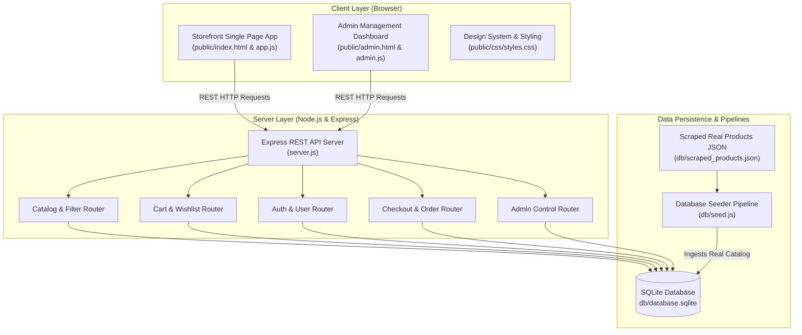
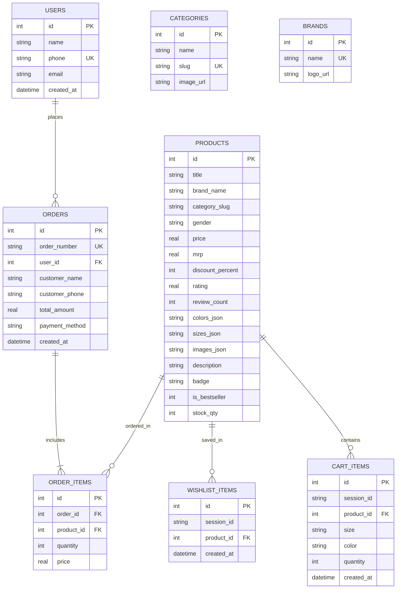

# Nykaa Fashion E-Commerce Architecture & System Design Document

## 1. System Overview

The **Nykaa Fashion E-Commerce Platform** is a full-stack e-commerce web application engineered with a clean single-page architecture (SPA), Node.js Express RESTful backend API, and a localized relational database powered by SQLite (`better-sqlite3`).

The system mimics the premium user experience of Nykaa Fashion, featuring real scraped catalog products, dynamic category filtering, search prioritization engines, cart-to-wishlist state synchronization, an "Are You Sure?" removal confirmation modal flow, user authentication with order history, and an isolated management Admin Portal.

---

## 2. High-Level System Architecture Diagram



---

## 3. Technology Stack

| Layer | Technology | Rationale / Benefits |
| :--- | :--- | :--- |
| **Frontend UI** | Vanilla HTML5, Vanilla JavaScript (ES6+), Modern Vanilla CSS3 | Zero framework bloat, fast load times, pixel-perfect control over Nykaa's premium design tokens. |
| **Backend Framework** | Node.js, Express.js | Lightweight, non-blocking asynchronous event loop, seamless JSON REST API rendering. |
| **Database** | SQLite via `better-sqlite3` | Synchronous, fast file-backed relational storage with zero network latency overhead. |
| **Data Ingestion** | Node.js custom seeder script | Converts scraped Nykaa product metadata (`scraped_products.json`) into relational tables. |

---

## 4. Module & Directory Layout

```
Nykaa fashion website/
├── db/
│   ├── database.sqlite       # Relational SQLite database file
│   ├── scraped_products.json # Real scraped Nykaa Fashion product catalog data
│   └── seed.js               # Database schema initialization & data seeding script
├── docs/
│   ├── architecture.md       # Architecture & System Design Document
│   └── implementation_plan.md# Execution & feature implementation plans
├── public/
│   ├── admin.html            # Isolated Admin Management Dashboard UI
│   ├── index.html            # Main Nykaa Storefront Single Page Application UI
│   ├── css/
│   │   └── styles.css        # Core Design System, tokens, glassmorphism, responsive styles
│   └── js/
│       ├── admin.js          # Admin dashboard frontend state & API interactions
│       └── app.js            # Storefront state machine, rendering engines & handlers
├── Screenshot/               # Official reference UI screenshots
├── server.js                 # Express server & REST API route handlers
└── package.json              # Project manifest & NPM scripts
```

---

## 5. Database Schema (SQLite Relational Model)



---

## 6. Key System Workflows & Algorithms

### 6.1 Homepage Showcase Blocks & Wishlist Prioritization
- The application evaluates active filters on `renderProducts()`. When on the homepage (`category === 'all'` and no search query active), it renders 3 curated showcase blocks:
  1. **🔥 Trending Now**: Best-selling, high-rated styles (`badge LIKE '%BESTSELLER%' OR rating >= 4.5`).
  2. **⚡ On Sale & Offers**: Items with heavy discount markdowns (`discount_percent >= 40%`).
  3. **✨ In The Spotlight**: Designer, luxe, and exclusive items (`category_slug = 'luxe' OR badge LIKE '%EXCLUSIVE%'`).
- **Wishlist Prioritization Logic**:
  - `buildBlockItems()` evaluates candidate products for each block.
  - Wishlisted items belonging to that block's criteria are placed **FIRST** in the block.
  - Renders wishlisted items with pink borders (`wishlist-featured-card`), a **`❤️ IN YOUR WISHLIST`** tag, and a 1-click **`MOVE TO BAG 🛍️`** button.

### 6.2 "Are You Sure?" Cart Removal Flow
- When a user clicks `✕` on a cart item in the Shopping Bag drawer, `app.promptRemoveCartItem(cartId)` triggers.
- Opens the **Remove Cart Item Confirmation Modal** (`#removeCartModal`):
  - **Thumbnail**: Displays the target product's thumbnail centered.
  - **Heading**: `"Are you sure?"`
  - **Subtext**: *"It took you so long to find this item, wishlist instead."*
  - **Primary CTA**: `"Move to wishlist"` -> calls `app.confirmMoveToWishlist()`, transferring the item into `wishlist_items` while removing it from `cart_items`.
  - **Secondary CTA**: `"Remove"` -> calls `app.confirmRemoveCartItem()`, deleting the item from `cart_items`.

### 6.3 Category-Aware Search Prioritization
- Searching via header search bar filters products across `title`, `brand_name`, `description`, `category_slug`, and `gender`.
- If the user has saved items in their wishlist matching the searched category, `renderProducts()` extracts those items and renders them at the very top under `❤️ From Your Wishlist (Matching Category)`.
- If no wishlist items match the searched category, the wishlist section is automatically suppressed.

---

## 7. Key REST API Endpoints Specification

| Endpoint | Method | Query / Body Params | Description |
| :--- | :--- | :--- | :--- |
| `/api/categories` | `GET` | None | Fetch all product categories |
| `/api/brands` | `GET` | None | Fetch all brand names & metadata |
| `/api/products` | `GET` | `category`, `brand`, `search`, `gender`, `minPrice`, `maxPrice`, `sort` | Query products with multi-parameter filter engine |
| `/api/cart` | `GET` | None | Fetch items in active session shopping bag |
| `/api/cart` | `POST` | `{ productId, size, color, quantity }` | Add item to shopping cart |
| `/api/cart/:id` | `DELETE` | Path `:id` | Remove item from cart |
| `/api/wishlist` | `GET` | None | Fetch user wishlisted items |
| `/api/wishlist/toggle` | `POST` | `{ productId }` | Toggle product in/out of wishlist |
| `/api/checkout` | `POST` | `{ customer_name, phone, address, payment_method, cart_items }` | Create order & record transaction |
| `/api/auth/send-otp` | `POST` | `{ identifier }` | Trigger mobile/email OTP authentication flow |
| `/api/auth/verify-otp` | `POST` | `{ identifier, otp, name }` | Verify OTP & persist user session |
| `/api/admin/stats` | `GET` | None | Fetch analytics stats for Admin Dashboard |

---

## 8. Development & Environment Instructions

1. **Install Dependencies**:
   ```bash
   npm install
   ```

2. **Seed Scraped Catalog into Database**:
   ```bash
   node db/seed.js
   ```

3. **Start Local Server**:
   ```bash
   npm start
   ```

4. **Access Applications**:
   - **Storefront**: `http://localhost:3000/`
   - **Admin Portal**: `http://localhost:3000/admin`
