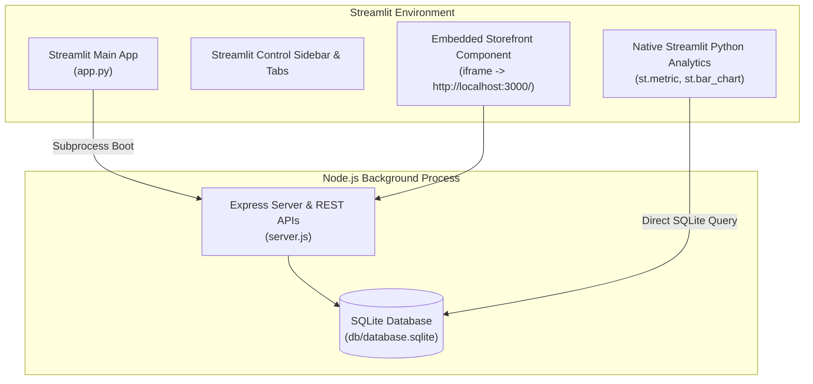

# Nykaa Fashion Streamlit Deployment Plan (`deployment.md`)

## 1. Executive Summary & Strategy

This deployment plan outlines the steps required to deploy both the **Frontend UI** and **Backend Express REST API** of the Nykaa Fashion E-Commerce platform using **Streamlit** (Streamlit Community Cloud or self-hosted Streamlit server).

The platform leverages a hybrid architecture:
- **`app.py`**: Streamlit entrypoint application that boots the Node.js Express server in the background and embeds the pixel-perfect HTML/CSS/JS Customer Storefront inside Streamlit components, alongside native Python SQLite analytics widgets.
- **`requirements.txt`**: Declares required Python libraries (`streamlit`, `requests`, `pandas`).
- **`packages.txt`**: Declares required OS dependencies for Streamlit Community Cloud (`nodejs`, `npm`).

---

## 2. Streamlit Deployment Architecture



---

## 3. Required File Manifest for Deployment

| File Path | Purpose in Streamlit Deployment | Status |
| :--- | :--- | :---: |
| **[`app.py`](file:///home/testing/Development/Nextleap%20projects/Nykaa%20fashion%20website%20/app.py)** | Main Streamlit application entrypoint handling subprocess startup & tab navigation. | **READY ✅** |
| **[`requirements.txt`](file:///home/testing/Development/Nextleap%20projects/Nykaa%20fashion%20website%20/requirements.txt)** | Python dependencies for Streamlit runtime (`streamlit`, `requests`, `pandas`). | **READY ✅** |
| **[`packages.txt`](file:///home/testing/Development/Nextleap%20projects/Nykaa%20fashion%20website%20/packages.txt)** | System-level packages required for Linux hosts (`nodejs`, `npm`). | **READY ✅** |
| **[`server.js`](file:///home/testing/Development/Nextleap%20projects/Nykaa%20fashion%20website%20/server.js)** | Express REST API server script. | **READY ✅** |
| **[`db/seed.js`](file:///home/testing/Development/Nextleap%20projects/Nykaa%20fashion%20website%20/db/seed.js)** | SQLite database table initialization & product catalog seeder. | **READY ✅** |

---

## 4. Deployment Execution Procedures

### Option A: Streamlit Community Cloud (Recommended Free Cloud Deployment)

1. **Step-by-Step Git Setup & Push to GitHub**:

   - **Initialize Git Repository** (if not already initialized):
     ```bash
     git init
     ```

   - **Create `.gitignore`** to exclude `node_modules`:
     ```bash
     echo "node_modules/" > .gitignore
     echo ".DS_Store" >> .gitignore
     ```

   - **Stage All Project & Deployment Files**:
     ```bash
     git add .
     ```

   - **Commit Changes**:
     ```bash
     git commit -m "Deploy Nykaa Fashion Streamlit Full-Stack Application"
     ```

   - **Set Remote Repository & Push to GitHub**:
     ```bash
     git remote add origin https://github.com/<YOUR_GITHUB_USERNAME>/nykaa-fashion-streamlit.git
     git branch -M main
     git push -u origin main
     ```

2. **Deploy on Streamlit Cloud**:
   - Log in to [share.streamlit.io](https://share.streamlit.io/).
   - Click **"New app"**.
   - Select your GitHub Repository (`nykaa-fashion-streamlit`), Branch (`main`), and set **Main file path** to `app.py`.
   - Click **"Deploy!"**.
   - Streamlit Cloud will read `packages.txt`, install `nodejs` & `npm`, install Python packages via `requirements.txt`, launch `app.py`, and automatically boot the embedded Express backend!

---

### Option B: Local or Virtual Machine (VM / EC2 / Docker) Deployment

1. **Install Node & Python Dependencies**:
   ```bash
   npm install
   pip install -r requirements.txt
   ```

2. **Initialize Database**:
   ```bash
   node db/seed.js
   ```

3. **Launch Application via Streamlit**:
   ```bash
   streamlit run app.py
   ```

4. **Access App**:
   - Streamlit UI will open automatically at **`http://localhost:8501/`**.

---

## 5. Verification & Health Checks

Once deployed, verify the following endpoints:
1. `http://<streamlit-host-url>/` -> Streamlit navigation hub loading Storefront, Admin, and Python Analytics tabs.
2. `http://localhost:3000/api/categories` -> Express backend API health check.
3. `http://localhost:3000/admin` -> Isolated Admin Dashboard.

---

> [!NOTE]
> **Deployment Action**: No deployment commands have been executed. All required code files (`app.py`, `requirements.txt`, `packages.txt`, `docs/deployment.md`) are configured and waiting for your explicit response to proceed.
