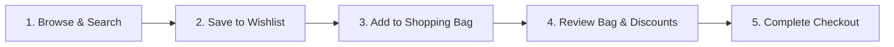

# 🛍️ Nykaa Fashion E-Commerce Platform

Welcome to the **Nykaa Fashion E-Commerce Platform**! This user guide and project overview explains everything about the application in simple, easy-to-understand terms.

---

## 🌟 Overview: What is this Project?

The **Nykaa Fashion E-Commerce Platform** is a modern online shopping web application built to mirror the seamless, premium shopping experience of **Nykaa Fashion**.

Whether you are looking for ethnic Indianwear, trendy Western outfits, luxury jewellery, or stylish handbags, this platform provides customers with an interactive shopping journey—from discovering items to saving favorites and completing orders.

```
┌──────────────────────────────────────────────────────────────────────────┐
│                           NYKAA FASHION STORE                            │
├───────────────────┬──────────────────────────────────┬───────────────────┤
│ 🔍 Search & Filter│ 🛍️ Product Catalog & Cart        │ ❤️ Saved Wishlist │
│ Find products by  │ Add items, pick sizes, calculate │ Save favorites &  │
│ brand or category │ savings, and place orders        │ view smart matches│
└───────────────────┴──────────────────────────────────┴───────────────────┘
```

---

## ✨ Key Features Made for Shoppers

### 1. 👗 Rich Product Catalog & Category Browsing
- **Extensive Collections**: Browse through various categories including **Women, Men, Kids, Indianwear, Westernwear, Bags, Jewellery**, and **Luxe**.
- **Interactive Filtering**: Filter products by gender, category, brand, and sort by price (low to high, high to low) or popularity.

### 2. 🔍 Smart Search with Wishlist Integration
- **Instant Search**: Type any keyword (such as *"earrings"*, *"dress"*, or *"shoes"*) into the search bar.
- **Wishlist Highlights**: If you have saved items in your wishlist that match your search or belong to the searched category, those items automatically pop up at the **very top** of your search results with a special badge tag (`❤️ IN YOUR WISHLIST`) and a quick `MOVE TO BAG 🛍️` button!

### 3. ❤️ Wishlist & Cart Synergy
- **One-Click Wishlist**: Click the heart icon on any product to save it to your personal wishlist.
- **Smart Cart Suggestions**: When you open your Shopping Bag (Cart), the platform automatically checks your wishlist and displays relevant items at the bottom so you can easily move saved items directly into your bag.
- **Wishlist Persistence**: Your saved wishlist items stay saved even if you refresh or close your browser.
- **Visual Notification Dots**: A subtle red dot indicator on the Wishlist icon notifies you whenever saved items are ready to review.

### 4. 👕 Fit & Size Picker
- **Size Selection**: For clothing items, customers are asked to choose their size (S, M, L, XL, etc.) before adding products to the cart, ensuring a personalized shopping experience.

### 5. 🛡️ Confirmation Safety Net
- **Accidental Deletion Protection**: Before removing an item from your wishlist, a gentle confirmation pop-up modal ("Are you sure?") asks for your confirmation to prevent accidental removals.

### 6. ⚙️ Admin Management Portal
- **Store Control Dashboard**: Store managers can access a separate management portal (`admin.html`) to:
  - Add new products to the catalog.
  - Update product prices and discount percentages.
  - Track total sales, active products, and customer orders.

---

## 🔄 How the Platform Works: A Simple Step-by-Step Flow



### Step 1: Discovering Products
Shoppers visit the homepage and use either the top navigation bar, category bubbles, or the search bar to find products they like.

### Step 2: Saving Favorites (Wishlist)
Clicking the **Heart Icon** ❤️ on any product card immediately saves it. The wishlist icon in the top header updates with a visual red badge indicator.

### Step 3: Adding to Shopping Bag
Clicking **"ADD TO BAG"** opens a size selection popup for clothing products. Once selected, the item is placed into the customer's Shopping Bag.

### Step 4: Reviewing Cart & Moving Wishlisted Items
Opening the Shopping Bag slides out a right drawer showing:
- Items in the bag with quantity controls (+ / -).
- Price calculations (Original Price, MRP, Savings, and Final Payment Total).
- A **"From Your Wishlist"** section highlighting matching saved items with a prominent `MOVE TO BAG 🛍️` button.

### Step 5: Placing the Order
Clicking **"Proceed to Buy"** creates a confirmed order, saves it to order history, and clears the cart for the next purchase.

---

## 🖥️ How to Run and View the App

To open and run the Nykaa Fashion application on your local machine, follow these 3 simple steps:

1. **Open your terminal / command prompt**.
2. **Start the application server**:
   ```bash
   npm start
   ```
3. **Open your web browser** and go to:
   - **Shopper Storefront**: [http://localhost:3000](http://localhost:3000)
   - **Admin Management Portal**: [http://localhost:3000/admin.html](http://localhost:3000/admin.html)

---

## 📄 Key Pages Overview

| Page Name | Web Address | What It's Used For |
| :--- | :--- | :--- |
| **Main Storefront** | `http://localhost:3000/` | Main shopping website for customers to search, browse, wishlist, and buy items. |
| **Admin Portal** | `http://localhost:3000/admin.html` | Dashboard for store managers to add products, adjust pricing, and inspect sales data. |

---

> 💡 **Need help or have questions?** Feel free to explore the project code or refer to technical architecture docs in the `docs/` folder for deeper system details!
